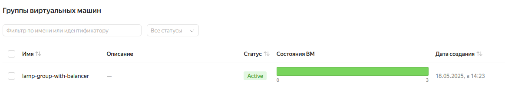
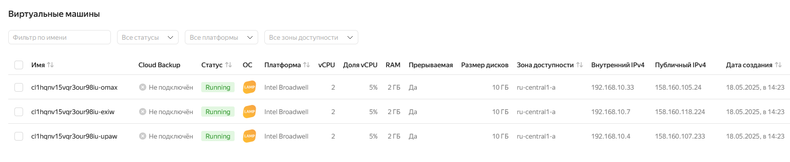
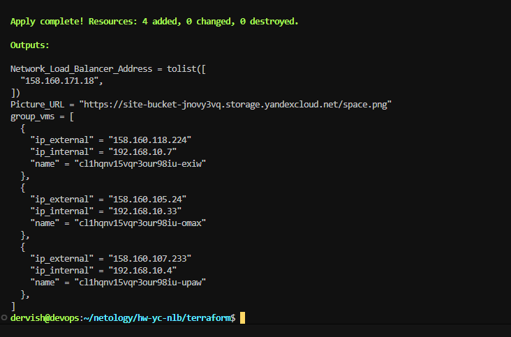
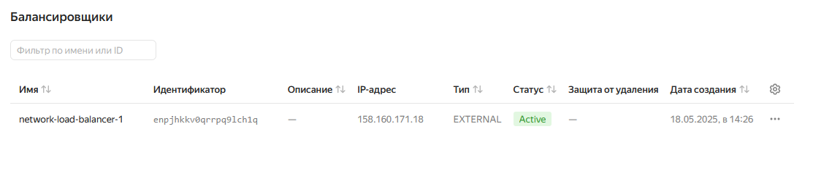
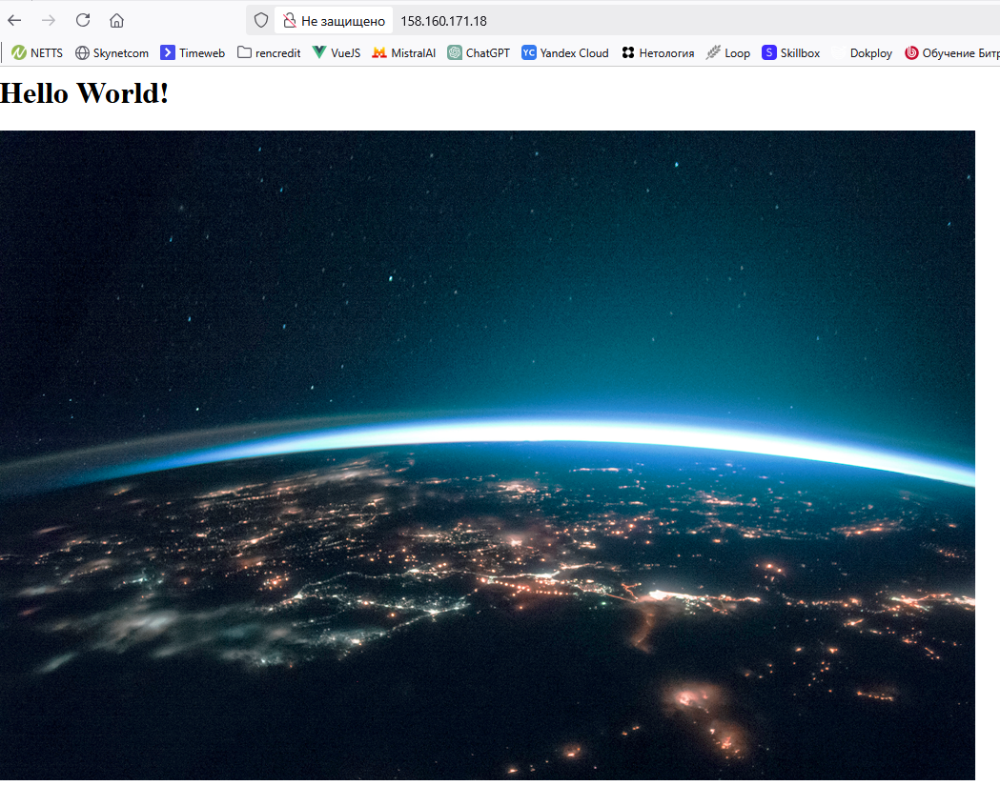
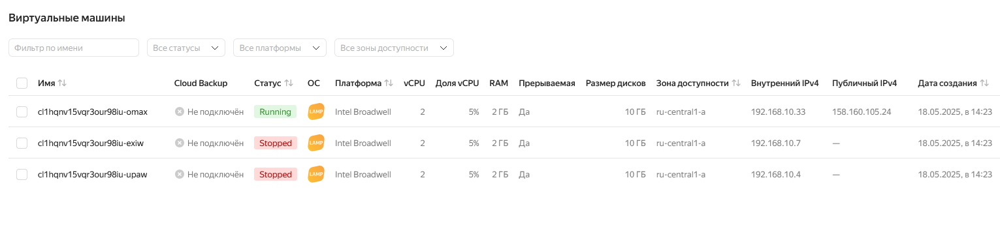

# Задание 1. Yandex Cloud

## 1. Создать бакет Object Storage и разместить в нём файл с картинкой:

    Создать бакет в Object Storage с произвольным именем (например, имя_студента_дата).
    Положить в бакет файл с картинкой.
    Сделать файл доступным из интернета.

>[s3.tf](./terraform/s3.tf)

## 2. Создать группу ВМ в public подсети фиксированного размера с шаблоном LAMP и веб-страницей, содержащей ссылку на картинку из бакета:

    Создать Instance Group с тремя ВМ и шаблоном LAMP. Для LAMP рекомендуется использовать image_id = fd827b91d99psvq5fjit.
    Для создания стартовой веб-страницы рекомендуется использовать раздел user_data в meta_data.
    Разместить в стартовой веб-странице шаблонной ВМ ссылку на картинку из бакета.
    Настроить проверку состояния ВМ.

>[group_vm.tf](./terraform/group_vm.tf)

## 3. Подключить группу к сетевому балансировщику:

    Создать сетевой балансировщик.
    Проверить работоспособность, удалив одну или несколько ВМ.

>[nlb.tf](./terraform/nlb.tf)

>Остановим две машины из трех и проверим работоспособность сайта

>Как видим, сайт работает!

## 4. (дополнительно)* Создать Application Load Balancer с использованием Instance group и проверкой состояния.
