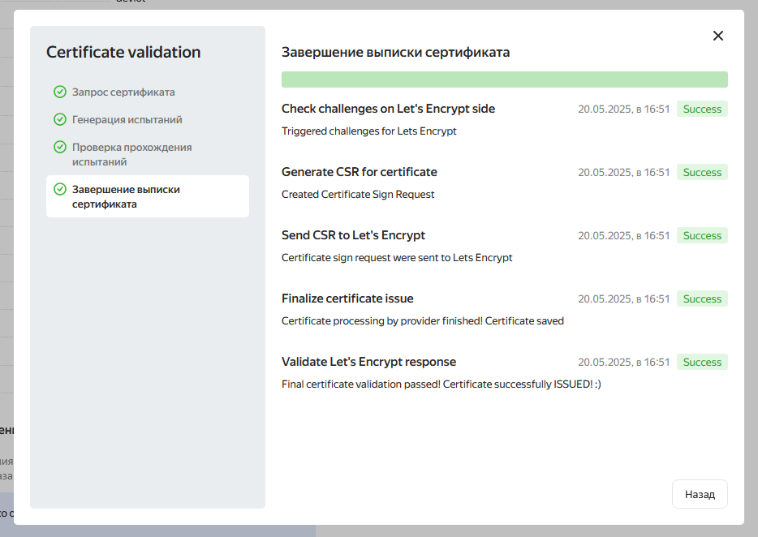

# Задание 1. Yandex Cloud

## 1. С помощью ключа в KMS необходимо зашифровать содержимое бакета:

    создать ключ в KMS;
    с помощью ключа зашифровать содержимое бакета, созданного ранее.

>Воспользуемся кодом из предыдущего ДЗ, оставив только работу с бакетом.

>[kms.tf](./terraform/kms.tf)

>[s3.tf](./terraform/s3.tf)

## 2. (Выполняется не в Terraform)* Создать статический сайт в Object Storage c собственным публичным адресом и сделать доступным по HTTPS:

    создать сертификат;
    создать статическую страницу в Object Storage и применить сертификат HTTPS;
    в качестве результата предоставить скриншот на страницу с сертификатом в заголовке (замочек).

